# SlidesGenerator

Gerador de apresentações HTML para a marca **Itaú Empresas**. Um arquivo `.html` que abre em qualquer browser — sem npm, sem build, sem dependências de runtime.

Dois modos de uso: **Skill para o Claude Code** (`/frontend-slides-pt`) ou **app React** com galeria de 32 templates.

---

## Usar com um agente de IA

Copie o texto abaixo e cole diretamente no seu agente (Claude Code, Cursor, Copilot, etc.). O agente vai clonar o repositório, ler o guia de configuração e fazer todo o setup automaticamente.

```
Clone o repositório https://github.com/Oliver-Data-Engineer/SlidesGenerator
e leia o arquivo SETUP.md — ele contém todas as instruções para configurar
o projeto corretamente: verificação de pré-requisitos, instalação de
dependências (Node.js, Python, Playwright), verificação do ambiente e
exemplos de uso. Siga cada seção em ordem antes de qualquer outra ação.
```

> O arquivo [`SETUP.md`](./SETUP.md) é o guia operacional completo do projeto para agentes IA: pré-requisitos, instalação passo a passo, verificações, scripts disponíveis e resolução de problemas.

---

## Get started

### Com Claude Code (recomendado)

Clone o repositório dentro de um projeto Claude Code e use o slash command:

```bash
git clone https://github.com/Oliver-Data-Engineer/SlidesGenerator
cd SlidesGenerator
npm install
```

No Claude Code:

```
/frontend-slides-pt Crie uma apresentação sobre crédito PME, 10 slides, tema executivo
```

A Skill lê o guia de marca e abre um diálogo de seleção. Veja como o fluxo funciona:

---

**Passo 1 — Escolha a família de templates:**

```
┌─────────────────────────────────────────────────────────────┐
│  Família de Templates                                        │
│                                                             │
│  ● Itaú Presets                                             │
│    8 estilos criados para a marca Itaú Empresas             │
│                                                             │
│  ○ Beautiful Templates                                      │
│    32 layouts externos adaptados com cores Itaú             │
└─────────────────────────────────────────────────────────────┘
```

---

**Passo 2a — Se escolher Itaú Presets**, a Skill abre 8 previews animados no browser e pergunta qual você prefere:

```
┌─────────────────────────────────────────────────────────────┐
│  Preset                                                     │
│                                                             │
│  ○ Itaú Escuro      — executivo, fundo azul #1F3B6B         │
│  ○ Itaú Claro       — corporativo limpo, fundo branco       │
│  ○ Itaú Split       — painel azul + branco, pitch deck      │
│  ○ Itaú Laranja     — impacto, fundo #EC7000                │
│  ● Itaú Tech        — dados e código, fundo #0f1e38         │
│  ○ Itaú Editorial   — relatórios premium                    │
│  ○ Bold Signal      — card laranja, fundo escuro            │
│  ○ Swiss Modern     — clean minimalista, Bauhaus            │
└─────────────────────────────────────────────────────────────┘
```

---

**Passo 2b — Se escolher Beautiful Templates**, a Skill agrupa os 32 por categoria:

```
┌─────────────────────────────────────────────────────────────┐
│  Categoria                                                  │
│                                                             │
│  ○ Escuros / Dramáticos                                     │
│    Vellum, Studio, Broadside, 8-Bit Orbit, Pink Script...  │
│                                                             │
│  ○ Claros / Editoriais                                      │
│    Soft Editorial, Monochrome, Cartesian, Playful...        │
│                                                             │
│  ● Coloridos / Criativos                                    │
│    Creative Mode, Block Frame, Daisy Days, Sakura...        │
│                                                             │
│  ○ Modernos / Tipográficos                                  │
│    Neo-Grid Bold, Cobalt Grid, Long Table, Coral...         │
└─────────────────────────────────────────────────────────────┘
```

Após escolher a categoria, você digita o nome do template desejado (ex: `Sakura Chroma`) e a Skill adapta o layout com a paleta Itaú e gera a apresentação completa.

---

**Resultado:** arquivo HTML autocontido salvo localmente, aberto automaticamente no browser, pronto para apresentar, exportar como PDF ou fazer deploy.

---

### Como app React (galeria de templates)

```bash
npm install
npm run dev
# → http://localhost:5173
```

Galeria dos 32 templates com wizard de customização.

### Compartilhar e exportar

```bash
# Deploy para URL pública (Vercel — funciona em qualquer dispositivo)
bash scripts/deploy.sh ./minha-apresentacao.html

# Exportar como PDF (requer Node.js)
bash scripts/export-pdf.sh ./minha-apresentacao.html

# Converter um arquivo .pptx para HTML (requer Python + python-pptx)
python scripts/extract-pptx.py ./deck.pptx ./output/
```

---

## Presets Itaú Empresas

A Skill gera apresentações em 8 presets visuais fiéis à marca. Abra qualquer arquivo em `public/itau-presets/` no browser para ver uma prévia animada.

> Para regenerar os screenshots: `bash scripts/screenshot-presets.sh`

<table>
<tr>
<td align="center" width="33%">
<a href="./public/itau-presets/01-itau-escuro.html">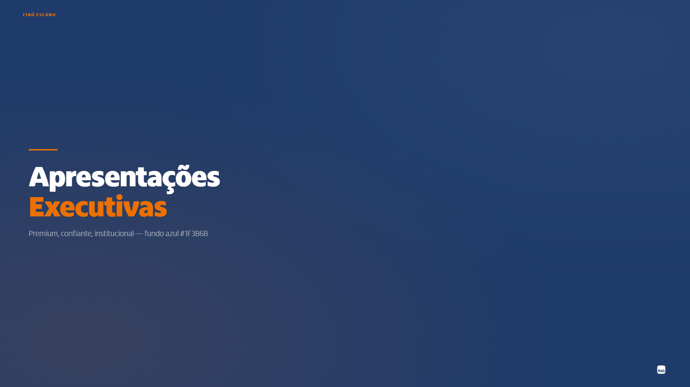</a>
<br><b>Itaú Escuro</b>
<br><small>Executivo, premium, institucional. Fundo azul <code>#1F3B6B</code>, destaque laranja.</small>
</td>
<td align="center" width="33%">
<a href="./public/itau-presets/02-itau-claro.html">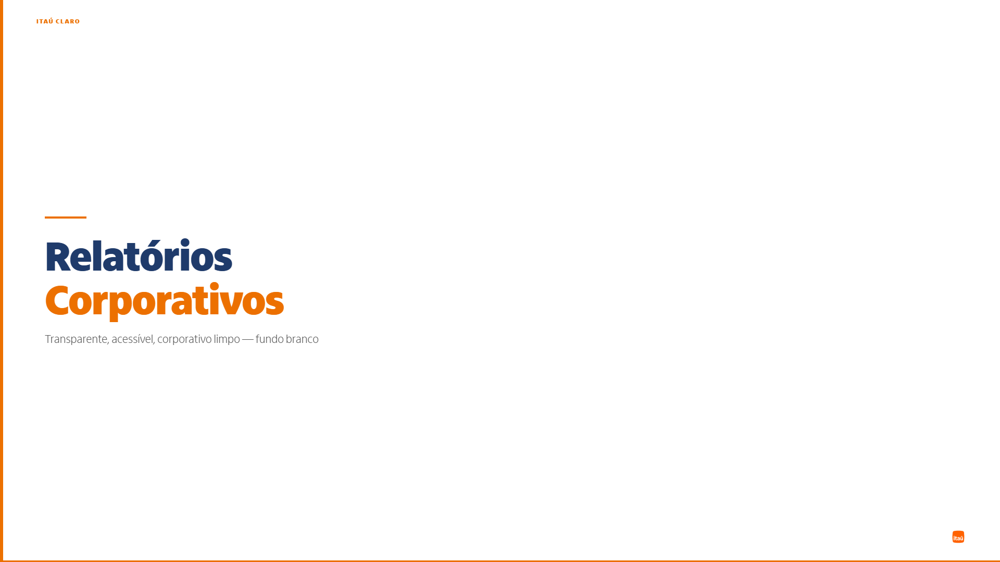</a>
<br><b>Itaú Claro</b>
<br><small>Transparente, acessível, corporativo limpo. Fundo branco, acentos laranja e azul.</small>
</td>
<td align="center" width="33%">
<a href="./public/itau-presets/03-itau-split.html">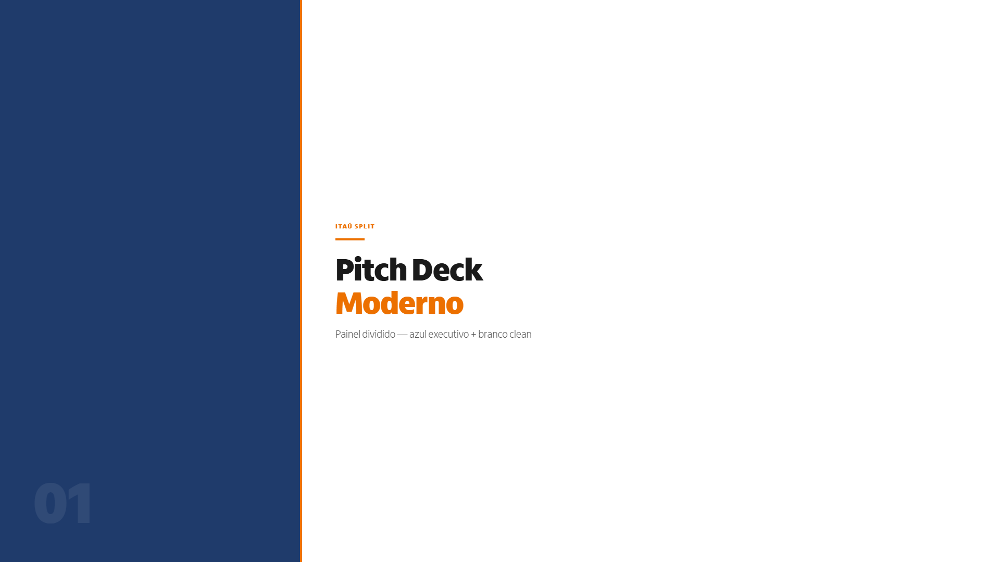</a>
<br><b>Itaú Split</b>
<br><small>Moderno, dinâmico. Painel azul (30%) + branco (70%), ideal para pitch decks.</small>
</td>
</tr>
<tr>
<td align="center" width="33%">
<a href="./public/itau-presets/04-itau-laranja.html">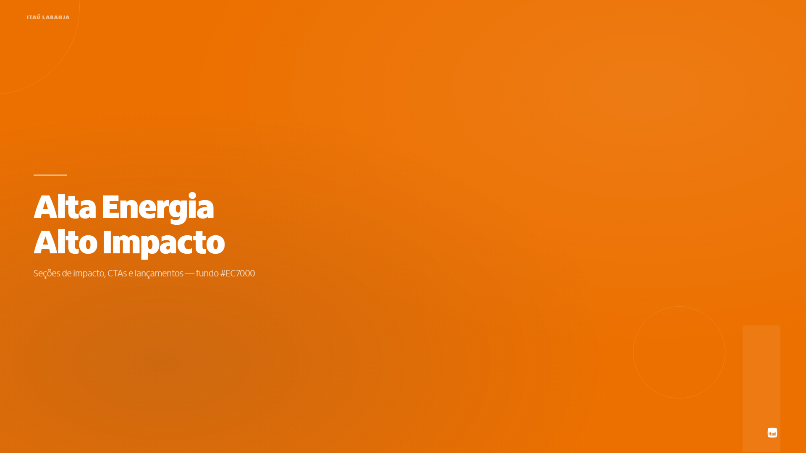</a>
<br><b>Itaú Laranja</b>
<br><small>Alta energia, impactante. Fundo <code>#EC7000</code> — para seções de destaque e CTAs.</small>
</td>
<td align="center" width="33%">
<a href="./public/itau-presets/05-itau-tech.html">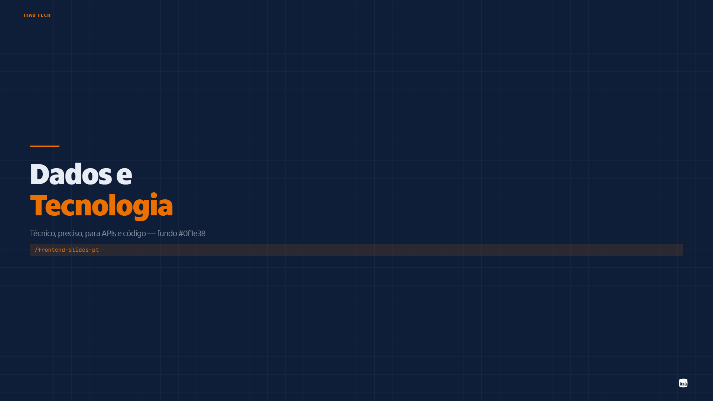</a>
<br><b>Itaú Tech</b>
<br><small>Técnico, preciso. Fundo <code>#0f1e38</code> com grid pattern — para dados, APIs e código.</small>
</td>
<td align="center" width="33%">
<a href="./public/itau-presets/06-itau-editorial.html">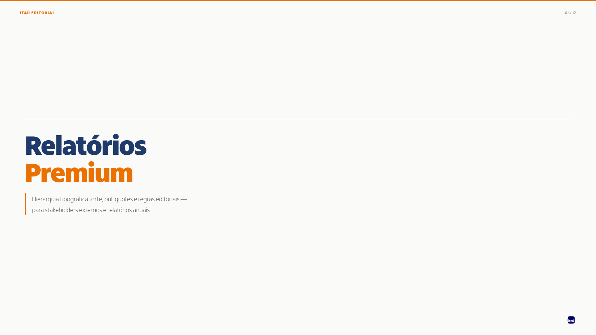</a>
<br><b>Itaú Editorial</b>
<br><small>Relatórios premium. Hierarquia tipográfica forte, pull quotes e regras editoriais.</small>
</td>
</tr>
<tr>
<td align="center" width="33%">
<a href="./public/itau-presets/07-bold-signal.html">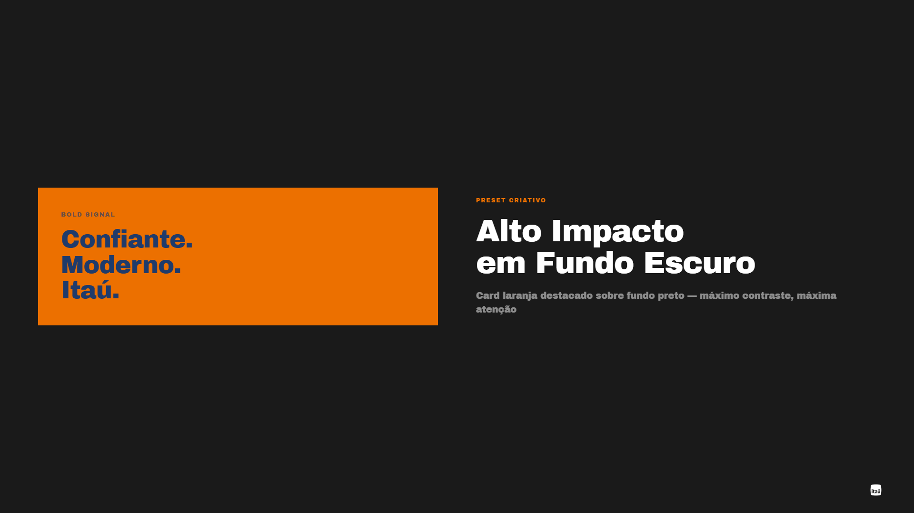</a>
<br><b>Bold Signal</b>
<br><small>Criativo, alto impacto. Card laranja em destaque sobre fundo escuro <code>#1A1A1A</code>.</small>
</td>
<td align="center" width="33%">
<a href="./public/itau-presets/08-swiss-modern.html">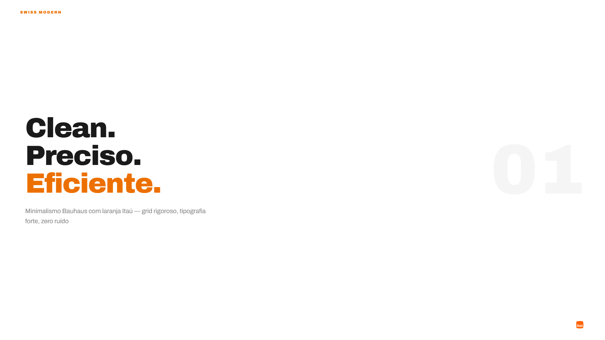</a>
<br><b>Swiss Modern</b>
<br><small>Clean, minimalista, inspiração Bauhaus. Branco + preto + laranja Itaú.</small>
</td>
<td width="33%"></td>
</tr>
</table>

---

## O que está incluído

| | |
|--|--|
| **8 presets visuais** | Marca Itaú Empresas, prontos para uso |
| **Skill Claude Code** | `/frontend-slides-pt` — gera slides a partir de um prompt |
| **Guia de marca** | `src/brand/` — cores, tipografia, logos, voz e tom em Markdown |
| **32 templates adaptados** | beautiful-html-templates com paleta Itaú (`samples/`) |
| **Scripts prontos** | deploy, PDF, extração de PPTX, screenshots, adaptação de templates |
| **Exemplo gerado** | `examples/skill-star/apresentacao.html` — 16 slides com metodologia STAR |

Para regenerar as amostras adaptadas:

```bash
python scripts/adapt-templates.py              # adapta os 32 templates → samples/
python scripts/screenshot-presets.py --samples # captura screenshots 1920×1080
```

---

## Requisitos

- **Node.js 18+** — app React + scripts de deploy e PDF
- **Python 3.8+** — apenas para `scripts/extract-pptx.py` (requer `pip install python-pptx`)

---

## Galeria de Templates — Paleta Itaú Empresas

32 templates da biblioteca [beautiful-html-templates](https://github.com/zarazhangrui/beautiful-html-templates), adaptados com cores e tipografia Itaú Empresas.
Abra qualquer arquivo `samples/[slug]/itau-[slug].html` no browser para ver a versão interativa.

<table>
<tr>
<td align="center" width="33%">
<a href="./samples/8-bit-orbit/itau-8-bit-orbit.html">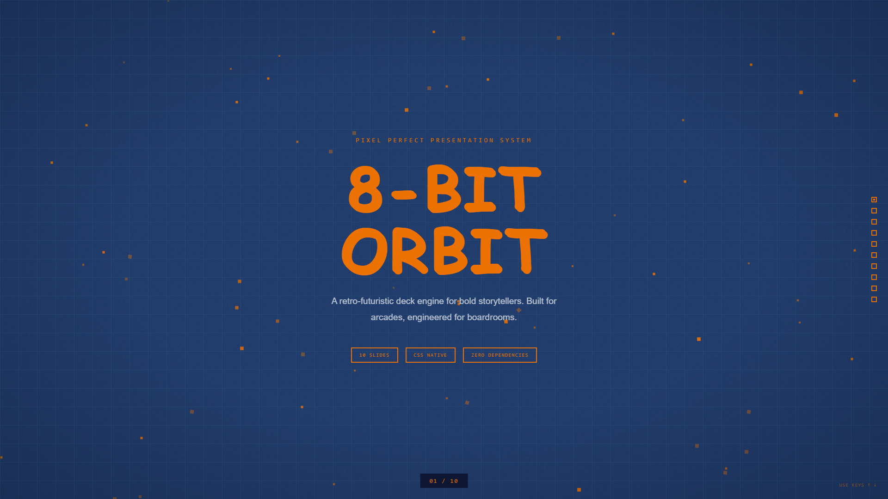</a>
<br><b>8-Bit Orbit</b>
<br><small>Estética arcade pixel-art neon sobre fundo azul profundo.</small>
</td>
<td align="center" width="33%">
<a href="./samples/biennale-yellow/itau-biennale-yellow.html"></a>
<br><b>Biennale Yellow</b>
<br><small>Amarelo solar em pergaminho quente com serifa índigo profunda e gradientes de brilho solar.</small>
</td>
<td align="center" width="33%">
<a href="./samples/block-frame/itau-block-frame.html">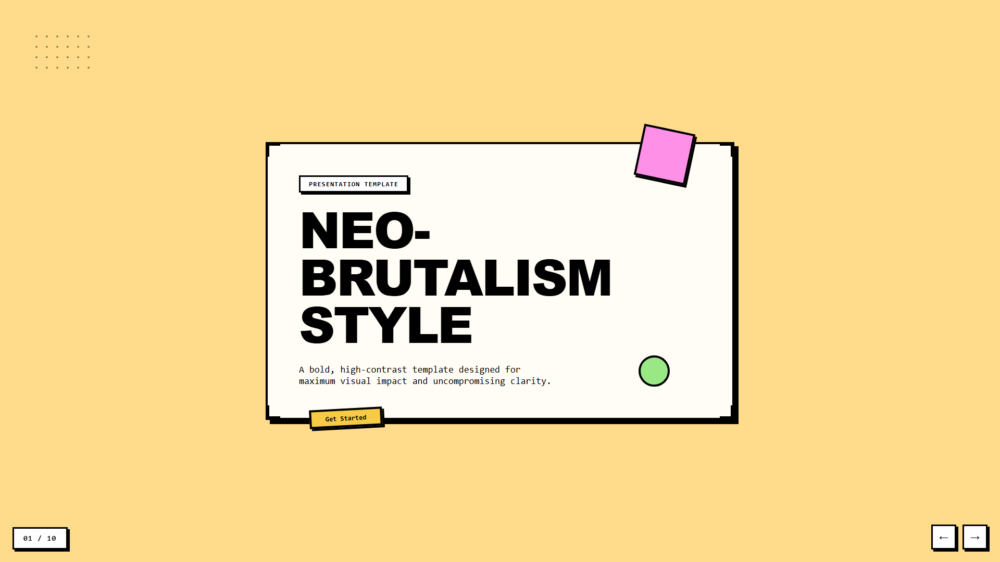</a>
<br><b>BlockFrame</b>
<br><small>Deck neo-brutalista com blocos de cores pastel-neon e bordas pretas espessas.</small>
</td>
</tr>
<tr>
<td align="center" width="33%">
<a href="./samples/blue-professional/itau-blue-professional.html">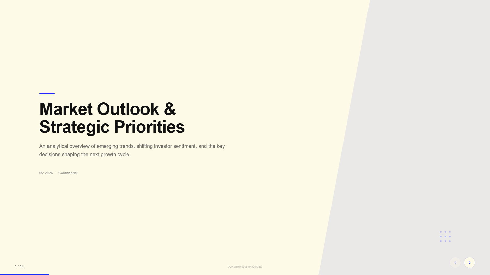</a>
<br><b>Blue Professional</b>
<br><small>Fundo papel creme com acentos azul-cobalto elétrico; moderno e profissional.</small>
</td>
<td align="center" width="33%">
<a href="./samples/bold-poster/itau-bold-poster.html">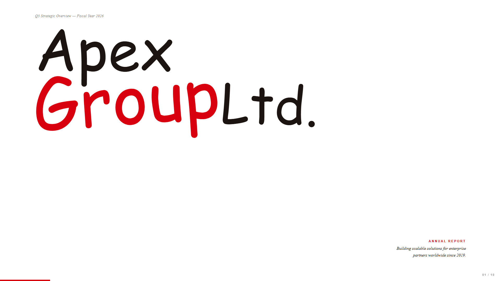</a>
<br><b>Bold Poster</b>
<br><small>Estética de pôster editorial com display gigante e único acento vermelho fogo.</small>
</td>
<td align="center" width="33%">
<a href="./samples/broadside/itau-broadside.html">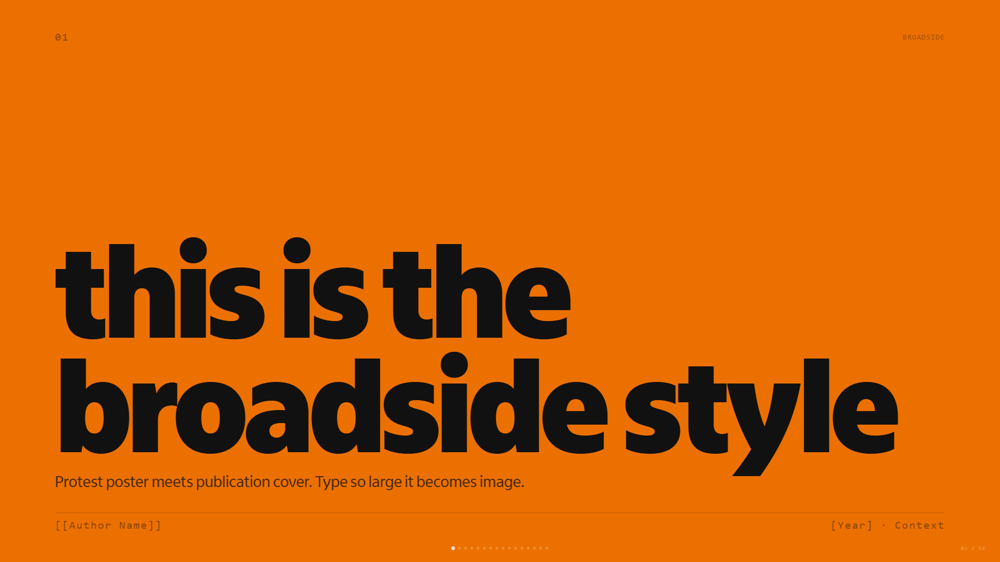</a>
<br><b>Broadside</b>
<br><small>Tela editorial escura com único acento laranja fogo e tipografia bilíngue latim/chinês.</small>
</td>
</tr>
<tr>
<td align="center" width="33%">
<a href="./samples/capsule/itau-capsule.html">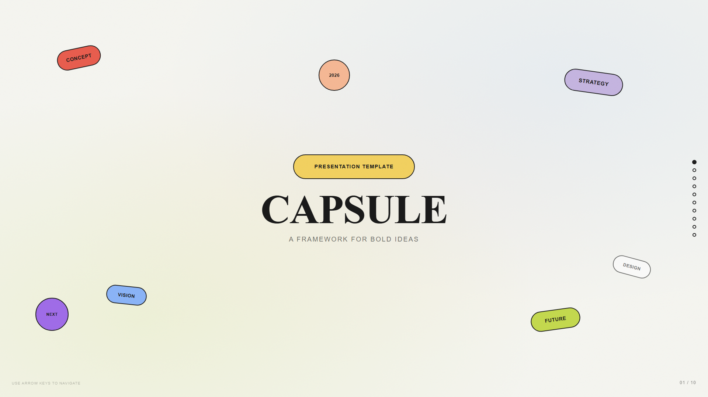</a>
<br><b>Capsule</b>
<br><small>Cards modulares em formato pílula sobre fundo bone quente com paleta pastel-pop completa.</small>
</td>
<td align="center" width="33%">
<a href="./samples/cartesian/itau-cartesian.html">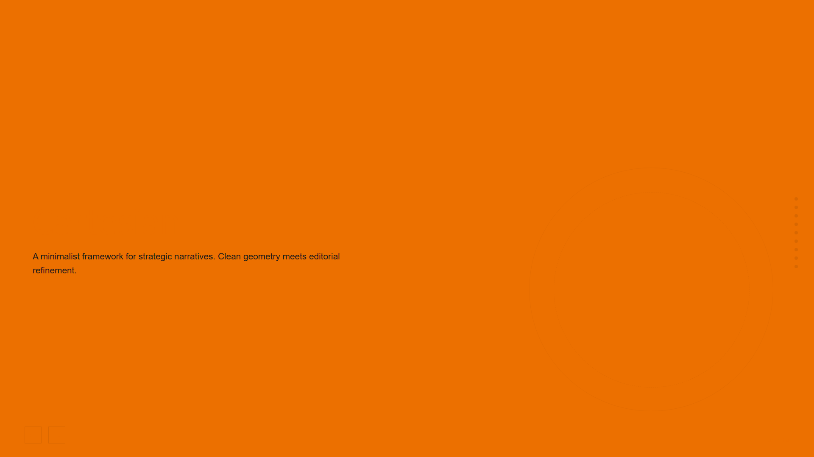</a>
<br><b>Cartesian</b>
<br><small>Paleta neutra-quente tranquila com serifas Playfair clássicas; discreto e sem pressa.</small>
</td>
<td align="center" width="33%">
<a href="./samples/cobalt-grid/itau-cobalt-grid.html">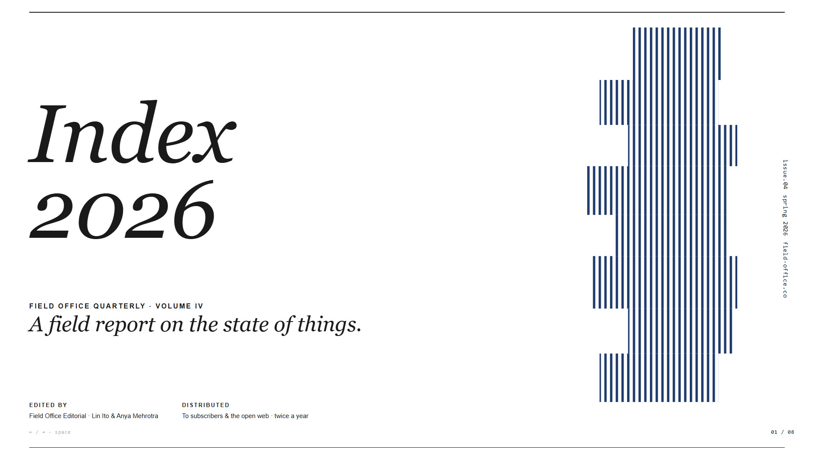</a>
<br><b>Cobalt Grid</b>
<br><small>Serifas itálicas cobalto elétrico em papel milimetrado com decorações pixel-glitch em degraus.</small>
</td>
</tr>
<tr>
<td align="center" width="33%">
<a href="./samples/coral/itau-coral.html">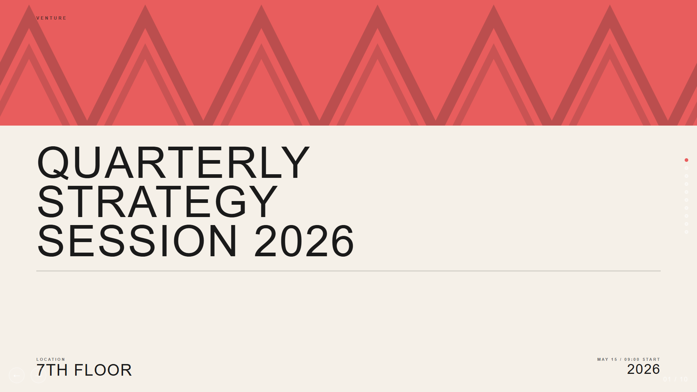</a>
<br><b>Coral</b>
<br><small>Creme e coral sobre quase-preto, em Bebas Neue gigante.</small>
</td>
<td align="center" width="33%">
<a href="./samples/creative-mode/itau-creative-mode.html">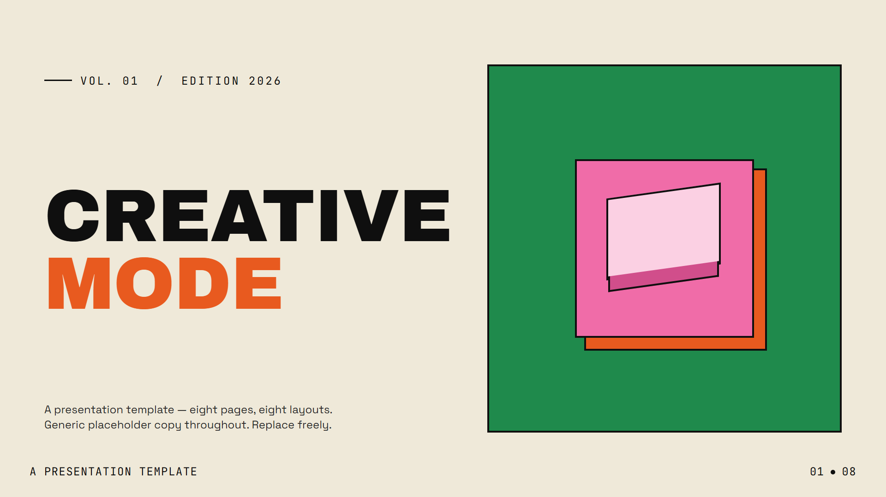</a>
<br><b>Creative Mode</b>
<br><small>Tela creme com acentos multicoloridos confiantes (verde, rosa, laranja, amarelo) e Archivo Black.</small>
</td>
<td align="center" width="33%">
<a href="./samples/daisy-days/itau-daisy-days.html">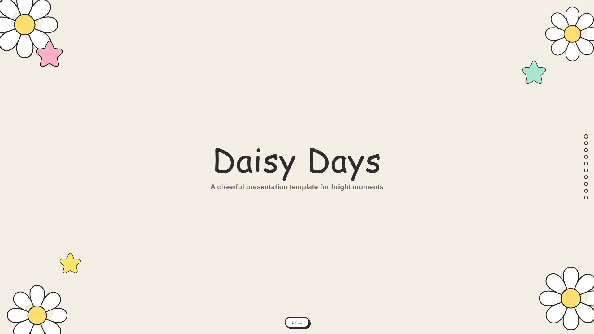</a>
<br><b>Daisy Days</b>
<br><small>Deck pastel alegre com margaridas, estrelas e arco-íris desenhados à mão. Amigável e caloroso.</small>
</td>
</tr>
<tr>
<td align="center" width="33%">
<a href="./samples/editorial-tri-tone/itau-editorial-tri-tone.html">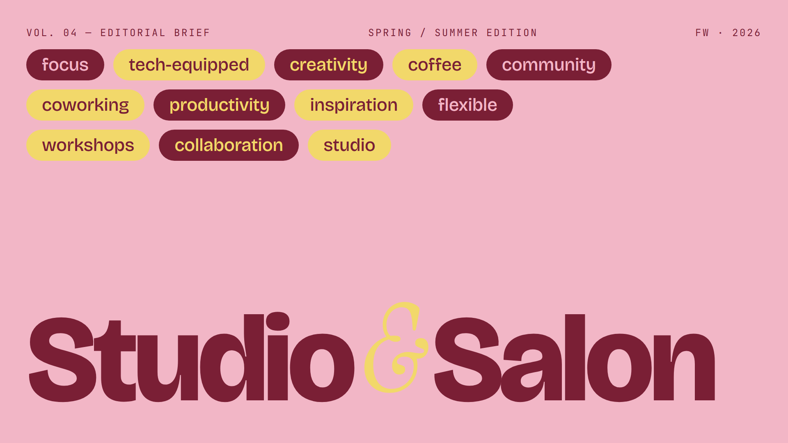</a>
<br><b>Editorial Tri-Tone</b>
<br><small>Sistema editorial tricromático: rosa empoeirado, mostarda creme e bordô, em Bricolage + Instrument Serif.</small>
</td>
<td align="center" width="33%">
<a href="./samples/grove/itau-grove.html">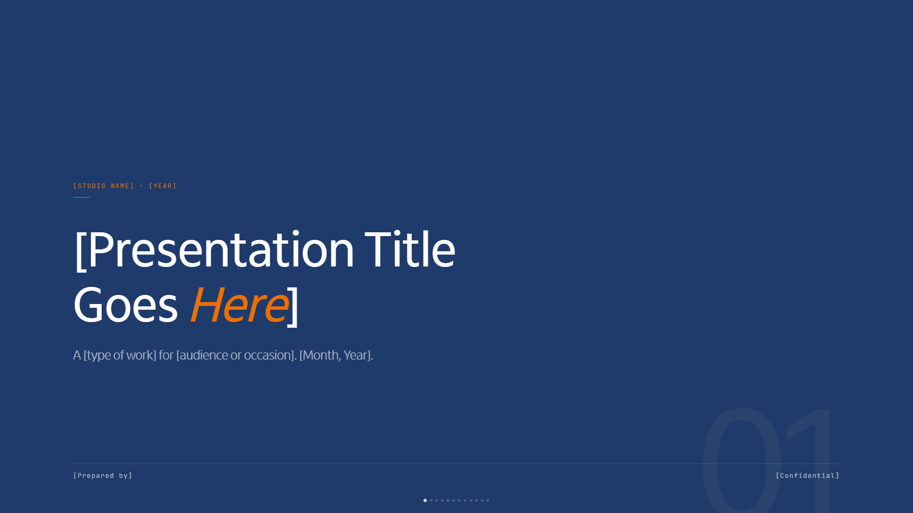</a>
<br><b>Grove</b>
<br><small>Tela verde-floresta com tipo creme, serifas Playfair clássicas e único acento ferrugem.</small>
</td>
<td align="center" width="33%">
<a href="./samples/long-table/itau-long-table.html">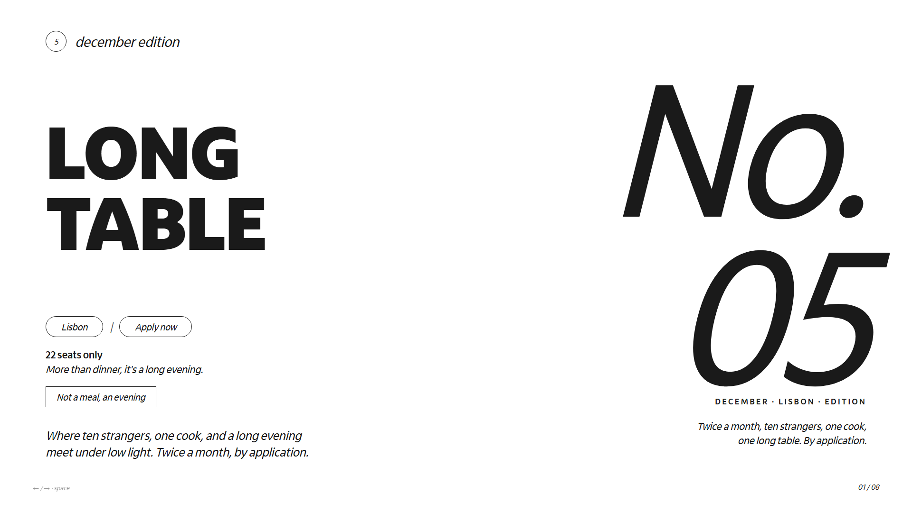</a>
<br><b>Long Table</b>
<br><small>Estética supper-club em creme e vermelho-ferrugem, com grotesk maiúsculo bold e Fraunces itálico.</small>
</td>
</tr>
<tr>
<td align="center" width="33%">
<a href="./samples/mat/itau-mat.html">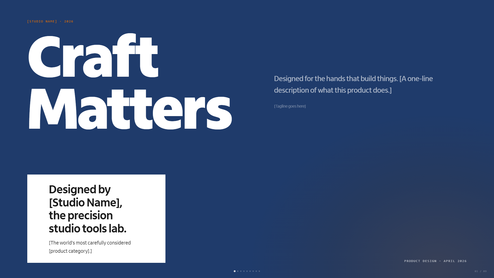</a>
<br><b>Mat</b>
<br><small>Tela sálvia escura com papel bone e acento laranja queimado; mid-century moderno com tons de madeira.</small>
</td>
<td align="center" width="33%">
<a href="./samples/monochrome/itau-monochrome.html">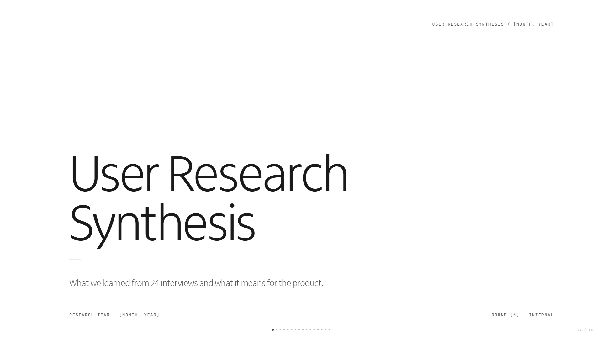</a>
<br><b>Monochrome</b>
<br><small>Papel ledger marfim com tipo all-black; serifas Lora nos títulos, Jost no corpo, zero cor.</small>
</td>
<td align="center" width="33%">
<a href="./samples/neo-grid-bold/itau-neo-grid-bold.html">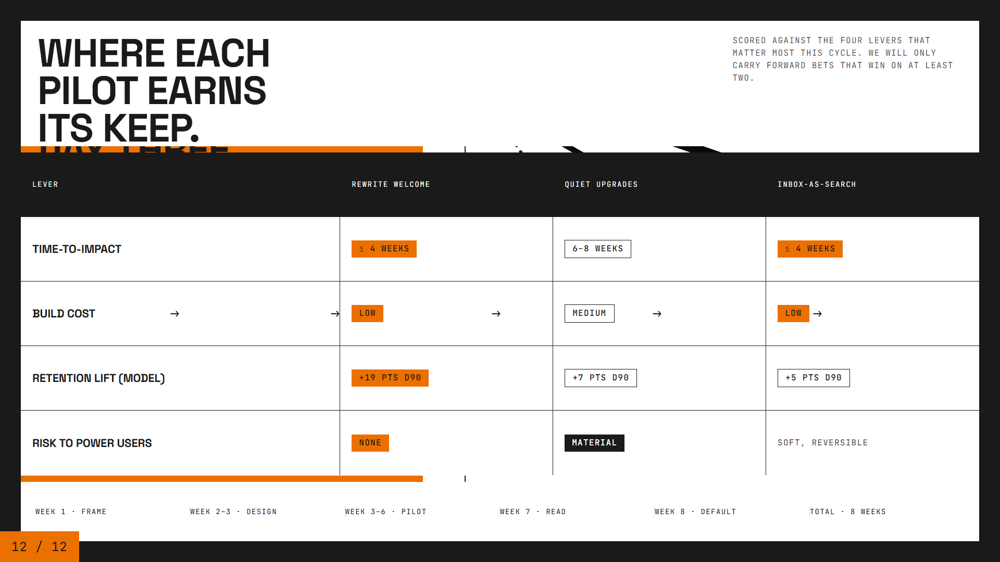</a>
<br><b>Neo-Grid Bold</b>
<br><small>Neo-brutalismo editorial com único acento amarelo neon em papel off-white.</small>
</td>
</tr>
<tr>
<td align="center" width="33%">
<a href="./samples/peoples-platform/itau-peoples-platform.html">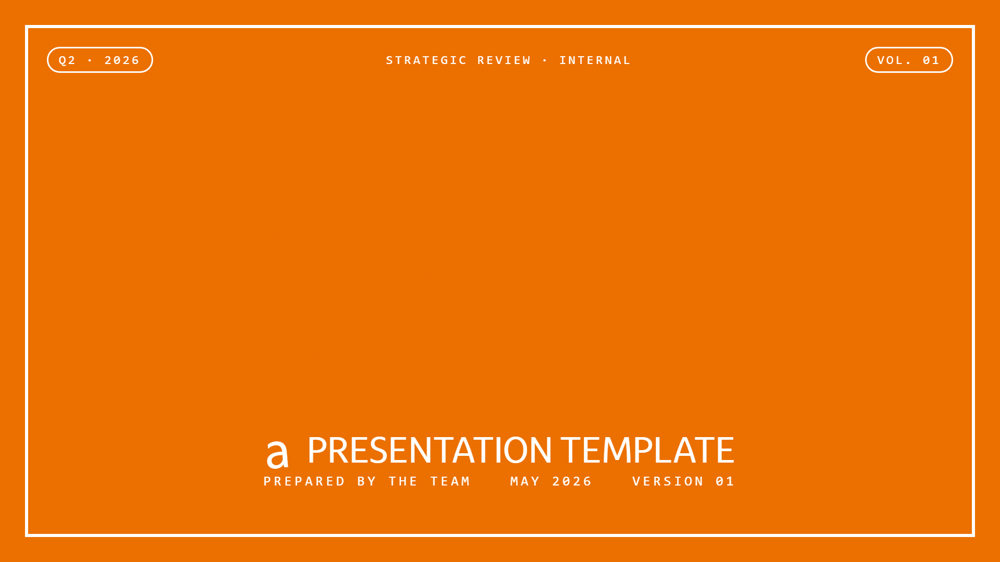</a>
<br><b>People's Platform</b>
<br><small>Energia de pôster ativista: azul, laranja e vermelho em creme, com Alfa Slab + Caveat Brush.</small>
</td>
<td align="center" width="33%">
<a href="./samples/pin-and-paper/itau-pin-and-paper.html">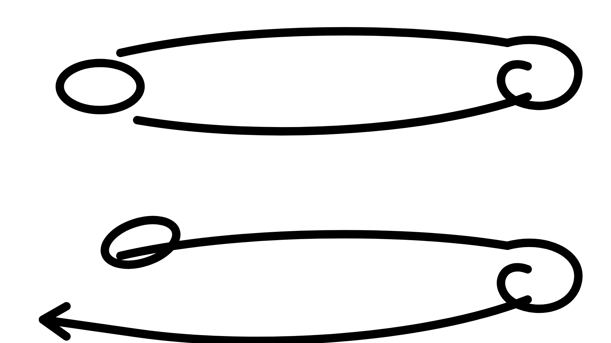</a>
<br><b>Pin &amp; Paper</b>
<br><small>Papel amarelo com ilustrações de alfinetes, Caveat azul manuscrito e textura de grão de papel.</small>
</td>
<td align="center" width="33%">
<a href="./samples/pink-script/itau-pink-script.html">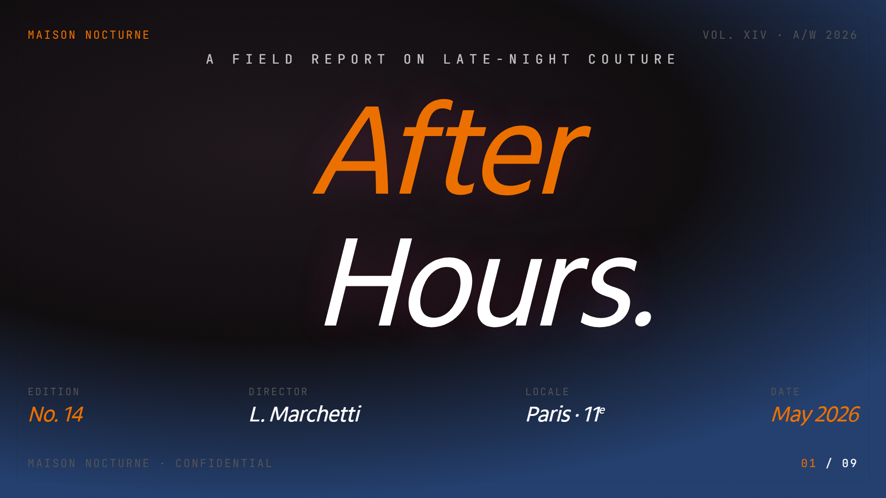</a>
<br><b>Pink Script — After Hours</b>
<br><small>Tela preta, acento rosa quente, papel pérola, Instrument Serif nos títulos: luxo editorial noturno.</small>
</td>
</tr>
<tr>
<td align="center" width="33%">
<a href="./samples/playful/itau-playful.html">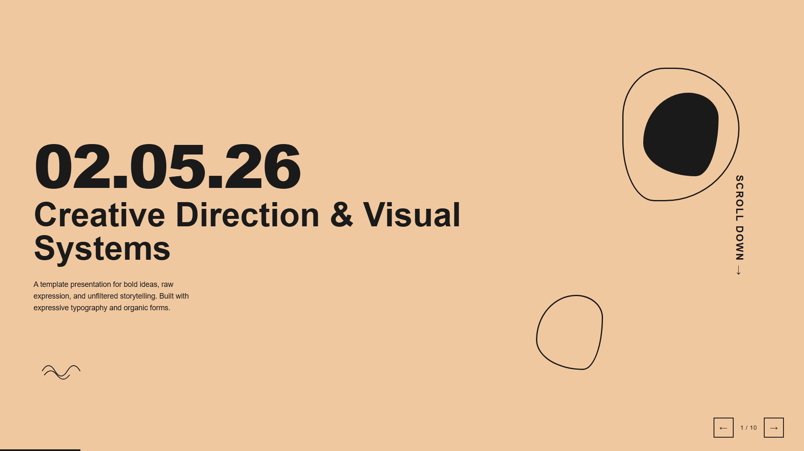</a>
<br><b>Playful</b>
<br><small>Fundo pêssego solar com Syne display: deck indie de lançamento amigável.</small>
</td>
<td align="center" width="33%">
<a href="./samples/raw-grid/itau-raw-grid.html">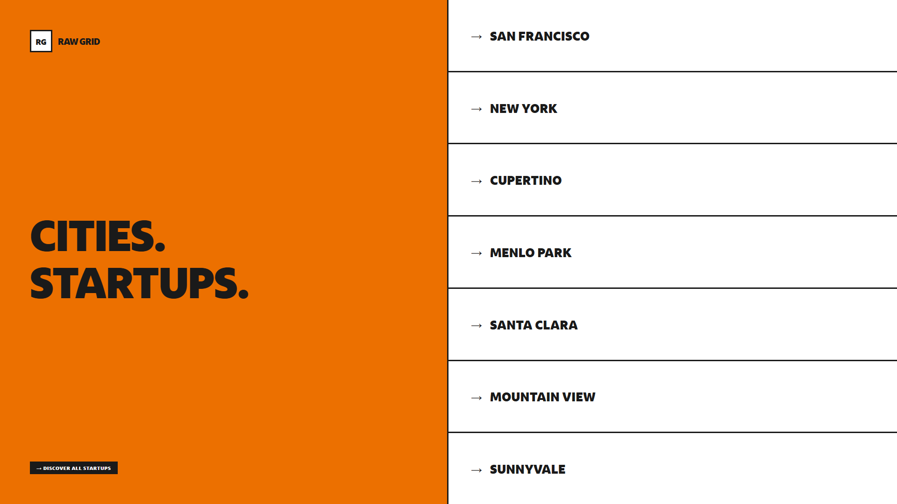</a>
<br><b>Raw Grid</b>
<br><small>Deck neo-brutalista com bordas espessas, sombras offset e paleta rosa/sálvia/tinta.</small>
</td>
<td align="center" width="33%">
<a href="./samples/retro-windows/itau-retro-windows.html">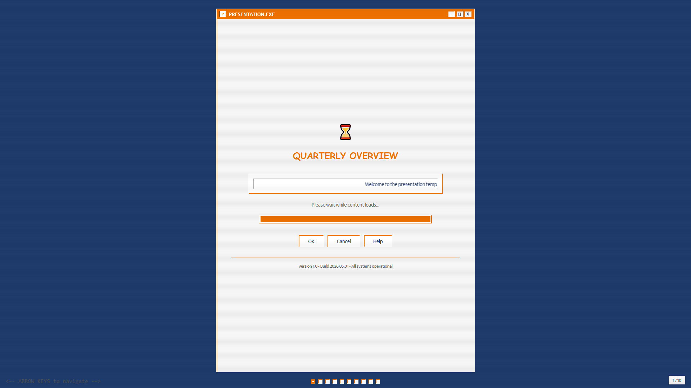</a>
<br><b>Retro Windows</b>
<br><small>Chrome do Windows 95: barras de título cinza, MS Sans Serif, tipografia pixel, pura nostalgia.</small>
</td>
</tr>
<tr>
<td align="center" width="33%">
<a href="./samples/retro-zine/itau-retro-zine.html">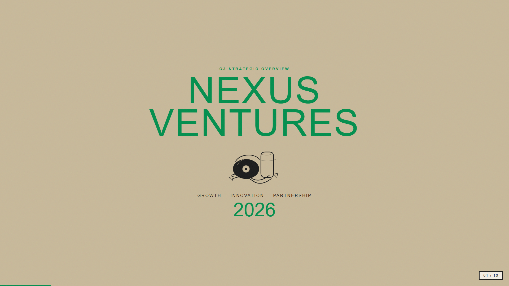</a>
<br><b>Retro Zine</b>
<br><small>Papel bege com acento verde e Bebas Neue + Caveat: um zine riso-impresso em forma de HTML.</small>
</td>
<td align="center" width="33%">
<a href="./samples/sakura-chroma/itau-sakura-chroma.html">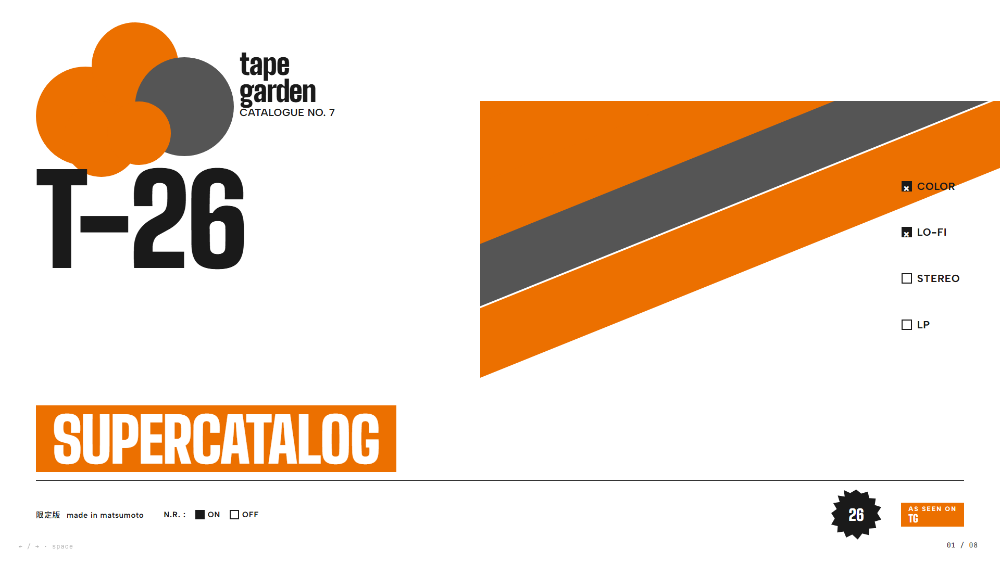</a>
<br><b>Sakura Chroma</b>
<br><small>Estética de embalagem cassete japonesa vintage: papel creme, fitas diagonais, tipo bold condensado.</small>
</td>
<td align="center" width="33%">
<a href="./samples/scatterbrain/itau-scatterbrain.html">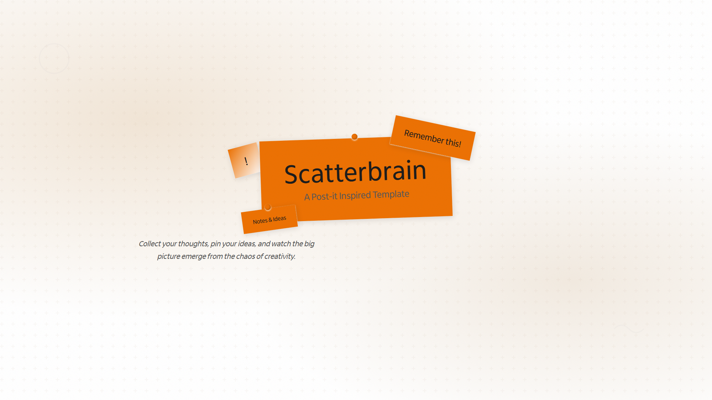</a>
<br><b>Scatterbrain</b>
<br><small>Inspirado em post-its: notas adesivas pastel, Caveat manuscrito, Shrikhand e Zilla Slab.</small>
</td>
</tr>
<tr>
<td align="center" width="33%">
<a href="./samples/signal/itau-signal.html">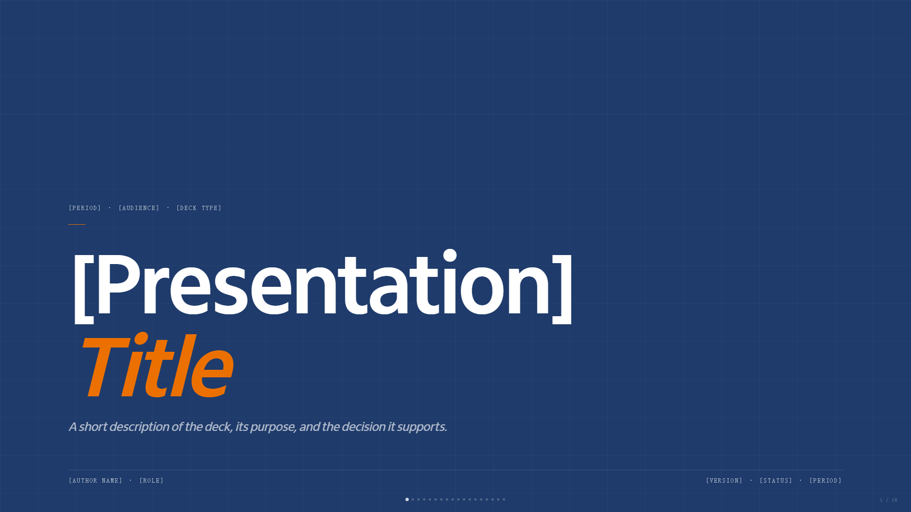</a>
<br><b>Signal</b>
<br><small>Tela azul profundo com papel bone e único acento dourado-suave; institucional com peso silencioso.</small>
</td>
<td align="center" width="33%">
<a href="./samples/soft-editorial/itau-soft-editorial.html"></a>
<br><b>Soft Editorial</b>
<br><small>Cormorant Garamond serif em papel quente com acentos sálvia, blush e limão.</small>
</td>
<td align="center" width="33%">
<a href="./samples/stencil-tablet/itau-stencil-tablet.html">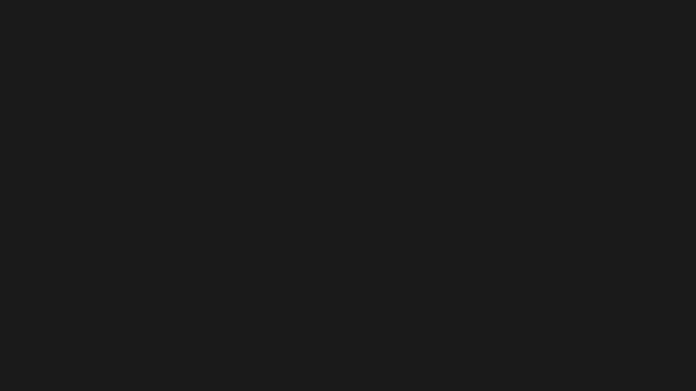</a>
<br><b>Stencil &amp; Tablet</b>
<br><small>Papel bone com títulos em estêncil e paleta de seis tons terrosos: arqueologia encontra a marca.</small>
</td>
</tr>
<tr>
<td align="center" width="33%">
<a href="./samples/studio/itau-studio.html">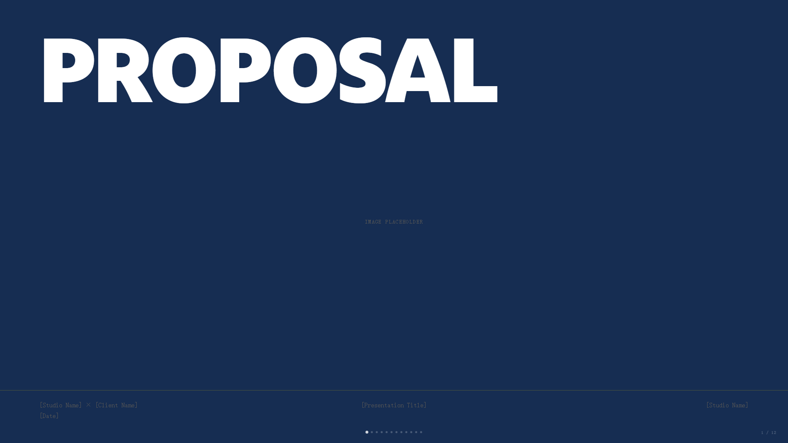</a>
<br><b>Studio</b>
<br><small>Tela preta com tipo amarelo elétrico; estética de estúdio de design de alta voltagem.</small>
</td>
<td align="center" width="33%">
<a href="./samples/vellum/itau-vellum.html">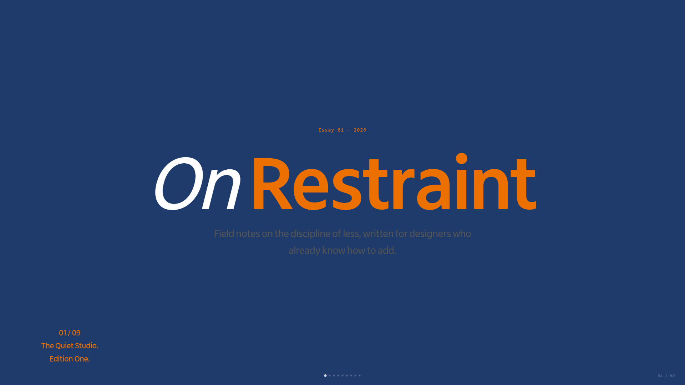</a>
<br><b>Vellum</b>
<br><small>Tela azul-profundo com Cormorant itálico amarelo-quente e único acento azul-empoeirado. Estética acadêmica.</small>
</td>
<td width="33%"></td>
</tr>
</table>

---

## Licença

[MIT](./LICENSE)
